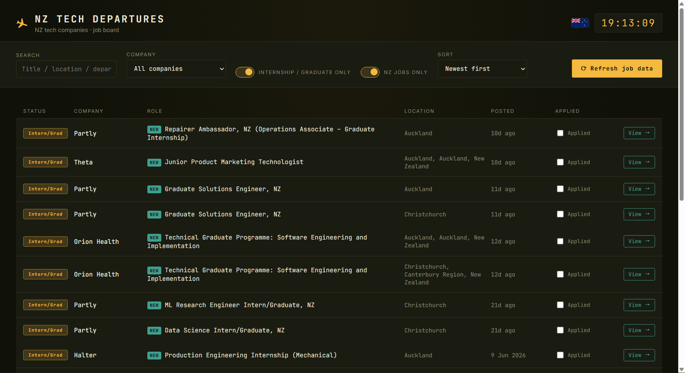

# NZ Tech Departures 🛫

**[Live demo](https://web-production-77eda.up.railway.app/)**



A job board that aggregates open roles from New Zealand tech companies, with
a one-click filter for internship / graduate positions. Data comes straight
from each company's applicant tracking system (ATS) **public JSON API** (not
HTML scraping — it's more stable and "more legitimate": these endpoints are
what the company's own careers page calls, so anyone can access them without
logging in or needing an API key).

Currently supports five common ATS providers: **Greenhouse / Lever / Ashby /
Workable / BambooHR**.

## Quick start

```bash
pip install -r requirements.txt
python app.py
```

Then open `http://localhost:5050` in your browser. A background job kicks
off a refresh automatically on startup (and every `REFRESH_INTERVAL_MINUTES`
minutes after that, default 60), so listings should appear within a few
seconds without you touching anything — the "Refresh job data" button is
there for triggering an immediate re-fetch on demand.

Flask's debug mode (auto-reload + interactive debugger) is off by default;
set `FLASK_DEBUG=1` if you want it while developing. Leave it off if you
ever expose this beyond localhost — the debugger allows arbitrary code
execution to anyone who can reach it.

## Deployment

The app is ready to run behind a production WSGI server (`Procfile` +
`gunicorn`, already in `requirements.txt`) instead of Flask's built-in dev
server. To deploy on [Railway](https://railway.app):

1. Sign in to Railway with your GitHub account and create a new project
   from this repo.
2. Railway auto-detects the Python app and reads `Procfile` for the start
   command (`gunicorn app:app --workers 1 --bind 0.0.0.0:$PORT`) — no extra
   config needed. Keep it at **1 worker**: each worker process starts its
   own copy of the background scheduler, so more than one would trigger
   duplicate refreshes.
3. Optionally set the `REFRESH_INTERVAL_MINUTES` environment variable to
   override the default 60-minute auto-refresh.
4. Once deployed, Railway gives you a public URL — that's your live demo
   link.

Note: `data/jobs.db` (SQLite) lives on the container's local disk, which
Railway's free tier does not persist across redeploys — a fresh deploy
starts with an empty database until the next auto-refresh repopulates it.
That's fine for a demo; for anything longer-lived, attach a
[Railway volume](https://docs.railway.app/reference/volumes) mounted at
`data/`.

## Project structure

```
├── app.py            # Flask backend + API routes
├── fetchers.py        # Talks to the Greenhouse/Lever/Ashby/Workable/BambooHR public APIs
├── db.py              # SQLite storage: jobs, applied-status, and refresh history (data/jobs.db, created automatically on first run)
├── companies.json     # Company list config (the main extensibility point, see below)
├── find_slug.py        # CLI tool: paste a careers page URL, auto-detect ATS type and slug
├── templates/index.html
└── static/style.css, script.js   # Frontend board (departures-board style)
```

## Companies currently included

`companies.json` starts with a handful of verified companies (Halter,
Partly, Sharesies, Education Perfect, Parrot Analytics, Soul Machines,
Karbon, Cin7, Kami, Pushpay, Serko, Theta, Laybuy, Orion Health) — just a
starting point. **The real value of a job aggregator
is the company list you curate yourself**, which is also a great talking
point in interviews: it shows you've researched the NZ tech ecosystem and
built a system that can keep growing, instead of hardcoding a handful of
entries.

### How to add more companies

1. Find the target company's careers page (e.g. Google "company name
   careers").
2. Run:
   ```bash
   python find_slug.py https://the-careers-page-url
   ```
   It will automatically figure out whether the company uses Greenhouse /
   Lever / Ashby / Workable / BambooHR, and print a config snippet you can
   paste straight into `companies.json`.
3. If detection fails, the company is probably using an in-house ATS (many
   large companies use Workday, for example) — this project doesn't support
   that yet, so just skip it.

There are plenty more NZ tech companies worth watching — it's worth going
through their careers pages yourself and verifying each one with the tool
above. Note that some big names (Xero, ServiceNow, Rocket Lab, Seequent,
LawVu, Dexibit) block simple automated requests to their careers pages
entirely (403 responses), so they'll need a manual check rather than
`find_slug.py`. A few others (Vend/Lightspeed, Timely, Serato, Mint
Innovation, First AML, Fisher & Paykel Appliances, Meridian Energy) render
their job board client-side with JavaScript or run an in-house/Workday
system, which `find_slug.py` can't see either — same "skip it" situation as
an in-house ATS. And occasionally a company's hosted job board page loads
fine in a browser but its public API is switched off (Chainlink Labs is one
example) — `find_slug.py` will detect the ATS but fail verification, which
is its way of telling you not to trust that guess.
The process itself is good job-search research.

## Features

- **Shows every open role by default**: not just internships — the full
  listing from each configured company
- **Keyword search**: filter by job title / location / department
- **Company filter**: pick a single company from the dropdown
- **Intern/graduate toggle**: automatically detects keywords like intern /
  graduate / junior / trainee in the title, one click to narrow down to
  just those
- **NZ-only toggle (on by default)**: several of these companies (Halter,
  Pushpay, Partly...) have expanded overseas and post far more roles abroad
  than in NZ. Each job's location is matched against NZ region/city names;
  anything with a location that's clearly not NZ is hidden unless you flip
  the switch off. Jobs with no location on file at all are kept visible
  rather than hidden, since some ATS records just don't report one.
- **Manual refresh**: click the button to re-fetch the latest listings from
  every company in real time, and automatically flag jobs that have been
  taken down (they get cleaned out of the database)
- **Failure isolation**: if one company's API is down, it won't affect the
  results from the others — the error is shown in the refresh status bar
- **Scheduled auto-refresh**: an APScheduler background job re-fetches every
  company on an interval (default 60 min, override with the
  `REFRESH_INTERVAL_MINUTES` env var), so listings stay current even if you
  never touch the button. The frontend also polls every 2 minutes to pick up
  whatever the background job found.
- **"NEW" badge**: any job first seen in the last 24 hours gets a badge in
  the listing, using the `first_seen_at` timestamp already tracked per job
- **Applied tracking**: check "Applied" on a row to mark it (persisted in
  its own `applied_jobs` table, independent of whether the listing later
  closes) — applied rows dim so you can see at a glance what's left to do

## Ideas for extra credit

- **Email/Telegram notifications**: get notified automatically when a new
  job appears (the `first_seen_at` tracking and scheduled refresh are
  already there — this would hook into that instead of re-fetching)
- **Unit tests**: write a few tests for the parsing logic in `fetchers.py`
  (can use recorded JSON fixtures as mocks) to show engineering rigor

## Tech stack

Python + Flask + SQLite + APScheduler (background auto-refresh) + vanilla
HTML/CSS/JS frontend (no frontend framework, kept simple and
straightforward so every line is easy to explain in an interview).

## License

[MIT](LICENSE)
